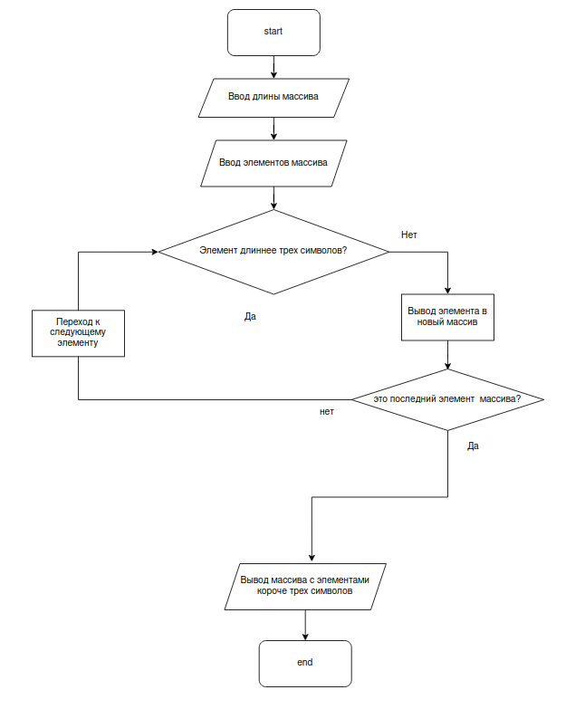

# Программа для вывода в массив элементов не длиннее трех символов.

Работает по следующему алгоритму:

## Ввод данных

1. Пользователю предлагается ввести длину массива.
2. Последовательно предлагается ввести каждый элемент массива.

## Фильтрация массива

1. С помощью цикла for проверяется длина каждого элемента массива по порядку.
2. Выводятся только те элементы, которые подходят под условие (короче трех символов).

## Вывод данных

1. Выводится изначально введенный массив.
2. Выводится отфильтрованный массив только с нужными элементами.
